# bun-react-template

To install dependencies:

```bash
bun install
```

To start a development server:

```bash
bun dev
```

To run for production:

```bash
bun start
```

This project was created using `bun init` in bun v1.3.0. [Bun](https://bun.com) is a fast all-in-one JavaScript runtime.

```mermaid
flowchart LR
    A[Discovery: Learns about Clara via gov.qc.ca or App Store]
    --> B[Onboarding: Downloads app, sets language & permissions]
    --> C[Exploration: Asks Clara for help renewing license]
    --> D[Assistance: Clara connects to ClicSÉQUR & guides process]
    --> E[Resolution: Renewal confirmed, email sent]
    --> F[Feedback: User rates experience and gives comments]

    A:::phase -->|Emotion: Curious| B:::phase
    B:::phase -->|Emotion: Cautious| C:::phase
    C:::phase -->|Emotion: Hopeful| D:::phase
    D:::phase -->|Emotion: Relieved| E:::phase
    E:::phase -->|Emotion: Happy| F:::phase
    F:::phase -->|Emotion: Trusting| End[End of Journey]

    classDef phase fill:#E6F0FF,stroke:#333,stroke-width:1px;
```



